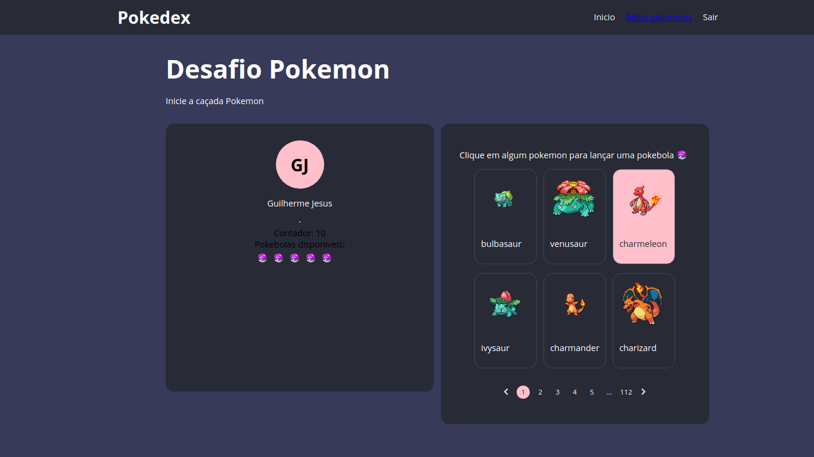

# Desafio React Pokemon Front-End

Projeto desenvolvido utilizando as seguintes tecnologias

- **React** para construção das interfaces
- **Styled-Components** e **Styled System** para estilização dos components de interface (Input, Texto, Layout)
- **Redux** e **Redux Saga** para gerenciamento de estado global da aplicação
- **React Router Dom** para implementar navegação entre telas
- **Axios** para requisições HTTP
- **LocalStorage** é uma API dos navegadores que serve para armazenar informações de forma nativa no "banco de dados" do browser.

---

## Funcionalidades

- Tela de inicio do site, onde é possivel brincar de capturar pokemon, fo utilizado nessa tela de inicio, Redux para controlar os eventos que são produzidos a partir da interação do usuario com a aplicação

    Nessa tela é feito uma listagem paginada do resultado da API do Pokemon [https://pokeapi.co/docs/v2](https://pokeapi.co/docs/v2)

    E tambem é possivel realizar tentativas para capturar um pokemon, apos ser capturado o pokemon é salvo na galeria de pokemons do usuario. 

- Tela de listagem dos pokemons capturado pelo usuario, aqui é possivel fazer uma visualização de todos os pokemons capturados e tambem na parte de cima do site há um campo de pesquisa, que filtra atraves do nome dos pokemons.

 

---

## Como executar o projeto

Bem simples, basta ter instalado no seu computador, é necessario uma versao do Node ≥ 10.15  instalado. 

Para iniciar, clone o repositorio para um local especifico e dentro da pasta front-end, execute o seguinte comando:

```bash
npm install # or npm i

# or

yarn install # or yarn
```

Leva alguns minutos...

Apos feita a instalação, faça:

```bash
npm start # or npm run start

# or

yarn start
```

Abrir no navegador, no endereço: http://localhost:3000



Tela de inicio do projeto

## Melhorias a ser implementadas

- Refatorar o codigo para otimização
- Fazer responsivo
- Implementar novas funcionalidades
- Adicionar suporte ao TypeScript
